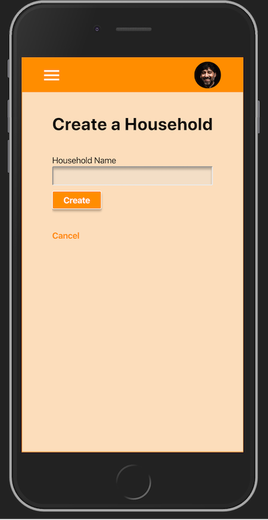
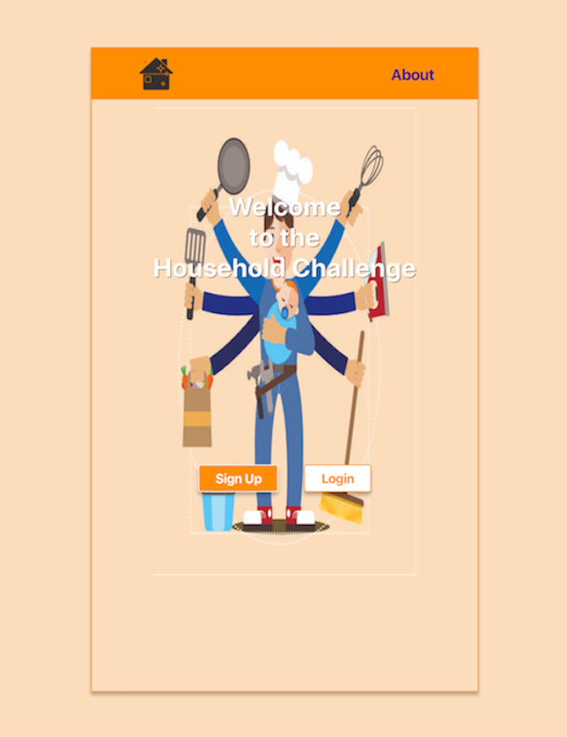

# Household Challenge
>  Making isolation fun!

**_As a user I want to create a fun concept of creating and completing tasks so that the household chores are completed._**

[Live Demo - Household Challenge](https://household-challenge-api.herokuapp.com/)

## Initial Configuration

Clone the respository and run npm install from the terminal.
```shell
$ git clone https://github.com/Eduardo-YGIAH/household-challenge.git

$ npm install
```
Running npm install will install all the root dependencies for the application.  
After the root dependencies have been installed, navigate to the client directory and install the client dependencies.
```shell 
$ cd client/

$ npm install
```

### Deploying / Publishing

Once the initial configuration is complete, run the code below in the comand line in the root directory and this will deploy the app.

```shell
$ npm run dev
```  

## Concept

* The concept of our app was to create a household which symbolises the house, flat or apartment the users live in, where the creator of the household can set challenges.
* Within these challenges are tasks for a members of the household to choose from. Each task has a value and at the end of the challenge specified by a date range will determine a winner and a loser. For which a forfeit will occur. For Example the first round of drinks...
* A user can create a household and they become the owner who sets out a challenge and create the tasks that need to be done. Note - Only one challenge can be created at a time.
* You can join a household if you have been invited by the owner and pick a task from the list available in the challenge.

## Technologies used

* React
* MongoDB/ Mongoose 
* Sass/ SCSS
* Nodemailer
* Mailgun
* Concurrently
* Validator
* Dotenv
* JWT
* Cloudinary  
<br />

## Screenshots

Mobile             |  Desktop
:-------------------------:|:-------------------------:
  |  

## Contributing

If you'd like to contribute, please email us directly on npatel_89@hotmail.com. We will then grant you permission to fork the repository and use a feature
branch. Pull requests are warmly welcome.

## Links

- Project homepage: https://household-challenge-api.herokuapp.com/
- Repository: https://github.com/Eduardo-YGIAH/household-challenge
- Issue tracker: https://github.com/Eduardo-YGIAH/household-challenge/issues
  - In the case of sensitive bugs like security vulnerabilities, please contact
    npatel_89@hotmail.com directly instead of using issue tracker. We value your effort
    to improve the security and privacy of this project!
- Related projects (UoB Trillogy Bootcamp):
  - Nilesh Patel: https://github.com/Nils224/fitness-App
  - Eduardo Neto: https://github.com/Eduardo-YGIAH/meetapp


## Licensing

_**The code in this project is licensed under MIT license.**_  
_**Copyright 2020**_

